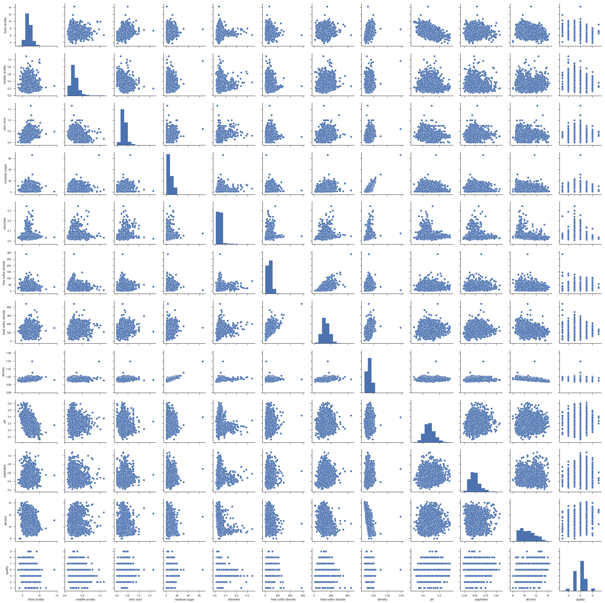

# Proyecto de Data Science con python + jupyter notebook + pandas


## Introducción
El área de la ciencia de datos (Data Science) ha mostrado un gran incremento en los últimos 10 años, principalmente por la facilidad en la extracción de datos y por el aumento en las capacidades de cálculo de los computadores.
En este cuaderno se mostrará de forma muy breve los pasos claves para llevar a cabo un proyecto (completo) de Data Science.  De entregan referencias al final de este cuaderno, que permitan indagar más sobre el tema.


## Los pasos en un proyecto de Data Science
En términos generales, es posible descomponer cualquier proyecto en Data Science en 5 grandes pasos:

1. Pregunta: Establecer una pregunta (científica) válida. ¿Qué es lo que quiero explorar? ¿Qué quiero investigar? ¿Qué hipótesis tengo?¿Qué quiero PREDECIR?

2. Obtener los datos: Preguntarse desde dónde vienen los datos que utilizaré para responder a mi pregunta. 
    ¿los tengo en un archivo local?¿están en internet?¿son de acceso libre o debo pagar?

3. Explorar los datos: Revisar los datos obtenidos de una forma exploratoria, me permite dirigir los esfuerzos para responder a mi pregunta de investigación. ¿Existen valores faltantes, y dónde puedo obtener los faltantes?¿hay variables que no sean numéricas?

4. Modelar los datos: Usualmente, mi pregunta puede o debe poder responderse a través de un modelo (Estadístico, regresion lineal, estocástico). Para ello debo crear el modelo, probarlo y validarlo.

5. Comunicar y visualizar los resultados: Sin una buena comunicación, clara, conscisa y precisa, todos los pasos anterior no tienen validez, pues no son capaces de entregar una respuesta adecuada a la pregunta planteada.

## Análisis de proyecto: Vinos blancos y Tintos
Para ejemplificar el proceso descrito anteriormente, se utilizará el dataset de vinos (disponible [aquí](https://archive.ics.uci.edu/ml/datasets/Wine+Quality)). Este set es de acceso público y la descripción de su utilidad se explica en el paper de [cortez et al., 2009](https://www.sciencedirect.com/science/article/pii/S0167923609001377)

En su paper, los autores presentan un caso de estudio para modelar la preferencia a cierto tipo de vino, basado en datos analíticos que son fácilmente adquiribles en el proceso de certificación del vino. Los autores señalan que  su modelo puede ayudar a segmentar el mercado y dirigir de mejor forma los esfuerzos de marketing y comercialización.

### Paso 1: Pregunta
<b> ¿Es posible encontrar alguna relación lineal o algún modelo simple que explique la preferencia de un vino debido a alguna de sus características fisicoquímicas?</b>

### Paso 2: Obtener los datos
Para este paso, importaremos las librerías necesarias en python y abriremos el archivo desde internet.  Nótese que la explicación del conjunto de datos se encuentra [descrito](https://archive.ics.uci.edu/ml/machine-learning-databases/wine-quality/winequality.names)


```python
import numpy as np  # necesaria para cálculos numéricos
import pandas as pd # necesaria para la manipulación de los datos
import matplotlib.pyplot as plt # necesaria para graficar
import seaborn as sns #gráficos más bonitos
import warnings
warnings.filterwarnings('ignore')#no mostrar mensajes de advertencia
sns.set(style="ticks") #Para manejo de los ejes
```


```python
# obtener y cargar los datos desde
# https://archive.ics.uci.edu/ml/machine-learning-databases/wine-quality/
direccion = 'https://archive.ics.uci.edu/ml/machine-learning-databases/wine-quality/'
archivo_tintos = direccion + 'winequality-red.csv'
red_wine = pd.read_csv(archivo_tintos, sep=';')

archivo_blancos = direccion + 'winequality-white.csv'
white_wine = pd.read_csv(archivo_blancos, sep=';')
```


```python
#Explorar si se cargaron bien los datos de vinos blancos...
white_wine.head()
```


<div>
<style scoped>
    .dataframe tbody tr th:only-of-type {
        vertical-align: middle;
    }

    .dataframe tbody tr th {
        vertical-align: top;
    }

    .dataframe thead th {
        text-align: right;
    }
</style>
<table border="1" class="dataframe">
  <thead>
    <tr style="text-align: right;">
      <th></th>
      <th>fixed acidity</th>
      <th>volatile acidity</th>
      <th>citric acid</th>
      <th>residual sugar</th>
      <th>chlorides</th>
      <th>free sulfur dioxide</th>
      <th>total sulfur dioxide</th>
      <th>density</th>
      <th>pH</th>
      <th>sulphates</th>
      <th>alcohol</th>
      <th>quality</th>
    </tr>
  </thead>
  <tbody>
    <tr>
      <th>0</th>
      <td>7.0</td>
      <td>0.27</td>
      <td>0.36</td>
      <td>20.7</td>
      <td>0.045</td>
      <td>45.0</td>
      <td>170.0</td>
      <td>1.0010</td>
      <td>3.00</td>
      <td>0.45</td>
      <td>8.8</td>
      <td>6</td>
    </tr>
    <tr>
      <th>1</th>
      <td>6.3</td>
      <td>0.30</td>
      <td>0.34</td>
      <td>1.6</td>
      <td>0.049</td>
      <td>14.0</td>
      <td>132.0</td>
      <td>0.9940</td>
      <td>3.30</td>
      <td>0.49</td>
      <td>9.5</td>
      <td>6</td>
    </tr>
    <tr>
      <th>2</th>
      <td>8.1</td>
      <td>0.28</td>
      <td>0.40</td>
      <td>6.9</td>
      <td>0.050</td>
      <td>30.0</td>
      <td>97.0</td>
      <td>0.9951</td>
      <td>3.26</td>
      <td>0.44</td>
      <td>10.1</td>
      <td>6</td>
    </tr>
    <tr>
      <th>3</th>
      <td>7.2</td>
      <td>0.23</td>
      <td>0.32</td>
      <td>8.5</td>
      <td>0.058</td>
      <td>47.0</td>
      <td>186.0</td>
      <td>0.9956</td>
      <td>3.19</td>
      <td>0.40</td>
      <td>9.9</td>
      <td>6</td>
    </tr>
    <tr>
      <th>4</th>
      <td>7.2</td>
      <td>0.23</td>
      <td>0.32</td>
      <td>8.5</td>
      <td>0.058</td>
      <td>47.0</td>
      <td>186.0</td>
      <td>0.9956</td>
      <td>3.19</td>
      <td>0.40</td>
      <td>9.9</td>
      <td>6</td>
    </tr>
  </tbody>
</table>
</div>


```python
#...y tintos
red_wine.head()
```


<div>
<style scoped>
    .dataframe tbody tr th:only-of-type {
        vertical-align: middle;
    }

    .dataframe tbody tr th {
        vertical-align: top;
    }

    .dataframe thead th {
        text-align: right;
    }
</style>
<table border="1" class="dataframe">
  <thead>
    <tr style="text-align: right;">
      <th></th>
      <th>fixed acidity</th>
      <th>volatile acidity</th>
      <th>citric acid</th>
      <th>residual sugar</th>
      <th>chlorides</th>
      <th>free sulfur dioxide</th>
      <th>total sulfur dioxide</th>
      <th>density</th>
      <th>pH</th>
      <th>sulphates</th>
      <th>alcohol</th>
      <th>quality</th>
    </tr>
  </thead>
  <tbody>
    <tr>
      <th>0</th>
      <td>7.4</td>
      <td>0.70</td>
      <td>0.00</td>
      <td>1.9</td>
      <td>0.076</td>
      <td>11.0</td>
      <td>34.0</td>
      <td>0.9978</td>
      <td>3.51</td>
      <td>0.56</td>
      <td>9.4</td>
      <td>5</td>
    </tr>
    <tr>
      <th>1</th>
      <td>7.8</td>
      <td>0.88</td>
      <td>0.00</td>
      <td>2.6</td>
      <td>0.098</td>
      <td>25.0</td>
      <td>67.0</td>
      <td>0.9968</td>
      <td>3.20</td>
      <td>0.68</td>
      <td>9.8</td>
      <td>5</td>
    </tr>
    <tr>
      <th>2</th>
      <td>7.8</td>
      <td>0.76</td>
      <td>0.04</td>
      <td>2.3</td>
      <td>0.092</td>
      <td>15.0</td>
      <td>54.0</td>
      <td>0.9970</td>
      <td>3.26</td>
      <td>0.65</td>
      <td>9.8</td>
      <td>5</td>
    </tr>
    <tr>
      <th>3</th>
      <td>11.2</td>
      <td>0.28</td>
      <td>0.56</td>
      <td>1.9</td>
      <td>0.075</td>
      <td>17.0</td>
      <td>60.0</td>
      <td>0.9980</td>
      <td>3.16</td>
      <td>0.58</td>
      <td>9.8</td>
      <td>6</td>
    </tr>
    <tr>
      <th>4</th>
      <td>7.4</td>
      <td>0.70</td>
      <td>0.00</td>
      <td>1.9</td>
      <td>0.076</td>
      <td>11.0</td>
      <td>34.0</td>
      <td>0.9978</td>
      <td>3.51</td>
      <td>0.56</td>
      <td>9.4</td>
      <td>5</td>
    </tr>
  </tbody>
</table>
</div>


### Paso 3: Explorar los datos
Para este análisis, primero se utilizarán las herramientas descriptivas de pandas y posteriormente se explorarán las variables en su conjunto.

#### 3.1: Vinos Tintos


```python
# esto me entrega estadísticas generales de los datos, tales como valores faltantes
# cantidad de columnas, tipos de datos, entre otros
red_wine.info() 
```

    <class 'pandas.core.frame.DataFrame'>
    RangeIndex: 1599 entries, 0 to 1598
    Data columns (total 12 columns):
    fixed acidity           1599 non-null float64
    volatile acidity        1599 non-null float64
    citric acid             1599 non-null float64
    residual sugar          1599 non-null float64
    chlorides               1599 non-null float64
    free sulfur dioxide     1599 non-null float64
    total sulfur dioxide    1599 non-null float64
    density                 1599 non-null float64
    pH                      1599 non-null float64
    sulphates               1599 non-null float64
    alcohol                 1599 non-null float64
    quality                 1599 non-null int64
    dtypes: float64(11), int64(1)
    memory usage: 150.0 KB


```python
red_wine.describe() #esto me entrega estadísticas generales de las columnas
```


<div>
<style scoped>
    .dataframe tbody tr th:only-of-type {
        vertical-align: middle;
    }

    .dataframe tbody tr th {
        vertical-align: top;
    }

    .dataframe thead th {
        text-align: right;
    }
</style>
<table border="1" class="dataframe">
  <thead>
    <tr style="text-align: right;">
      <th></th>
      <th>fixed acidity</th>
      <th>volatile acidity</th>
      <th>citric acid</th>
      <th>residual sugar</th>
      <th>chlorides</th>
      <th>free sulfur dioxide</th>
      <th>total sulfur dioxide</th>
      <th>density</th>
      <th>pH</th>
      <th>sulphates</th>
      <th>alcohol</th>
      <th>quality</th>
    </tr>
  </thead>
  <tbody>
    <tr>
      <th>count</th>
      <td>1599.000000</td>
      <td>1599.000000</td>
      <td>1599.000000</td>
      <td>1599.000000</td>
      <td>1599.000000</td>
      <td>1599.000000</td>
      <td>1599.000000</td>
      <td>1599.000000</td>
      <td>1599.000000</td>
      <td>1599.000000</td>
      <td>1599.000000</td>
      <td>1599.000000</td>
    </tr>
    <tr>
      <th>mean</th>
      <td>8.319637</td>
      <td>0.527821</td>
      <td>0.270976</td>
      <td>2.538806</td>
      <td>0.087467</td>
      <td>15.874922</td>
      <td>46.467792</td>
      <td>0.996747</td>
      <td>3.311113</td>
      <td>0.658149</td>
      <td>10.422983</td>
      <td>5.636023</td>
    </tr>
    <tr>
      <th>std</th>
      <td>1.741096</td>
      <td>0.179060</td>
      <td>0.194801</td>
      <td>1.409928</td>
      <td>0.047065</td>
      <td>10.460157</td>
      <td>32.895324</td>
      <td>0.001887</td>
      <td>0.154386</td>
      <td>0.169507</td>
      <td>1.065668</td>
      <td>0.807569</td>
    </tr>
    <tr>
      <th>min</th>
      <td>4.600000</td>
      <td>0.120000</td>
      <td>0.000000</td>
      <td>0.900000</td>
      <td>0.012000</td>
      <td>1.000000</td>
      <td>6.000000</td>
      <td>0.990070</td>
      <td>2.740000</td>
      <td>0.330000</td>
      <td>8.400000</td>
      <td>3.000000</td>
    </tr>
    <tr>
      <th>25%</th>
      <td>7.100000</td>
      <td>0.390000</td>
      <td>0.090000</td>
      <td>1.900000</td>
      <td>0.070000</td>
      <td>7.000000</td>
      <td>22.000000</td>
      <td>0.995600</td>
      <td>3.210000</td>
      <td>0.550000</td>
      <td>9.500000</td>
      <td>5.000000</td>
    </tr>
    <tr>
      <th>50%</th>
      <td>7.900000</td>
      <td>0.520000</td>
      <td>0.260000</td>
      <td>2.200000</td>
      <td>0.079000</td>
      <td>14.000000</td>
      <td>38.000000</td>
      <td>0.996750</td>
      <td>3.310000</td>
      <td>0.620000</td>
      <td>10.200000</td>
      <td>6.000000</td>
    </tr>
    <tr>
      <th>75%</th>
      <td>9.200000</td>
      <td>0.640000</td>
      <td>0.420000</td>
      <td>2.600000</td>
      <td>0.090000</td>
      <td>21.000000</td>
      <td>62.000000</td>
      <td>0.997835</td>
      <td>3.400000</td>
      <td>0.730000</td>
      <td>11.100000</td>
      <td>6.000000</td>
    </tr>
    <tr>
      <th>max</th>
      <td>15.900000</td>
      <td>1.580000</td>
      <td>1.000000</td>
      <td>15.500000</td>
      <td>0.611000</td>
      <td>72.000000</td>
      <td>289.000000</td>
      <td>1.003690</td>
      <td>4.010000</td>
      <td>2.000000</td>
      <td>14.900000</td>
      <td>8.000000</td>
    </tr>
  </tbody>
</table>
</div>


```python
red_wine.isnull().sum() #re-revisar si hay valores faltantes
```


    fixed acidity           0
    volatile acidity        0
    citric acid             0
    residual sugar          0
    chlorides               0
    free sulfur dioxide     0
    total sulfur dioxide    0
    density                 0
    pH                      0
    sulphates               0
    alcohol                 0
    quality                 0
    dtype: int64


```python
sns.pairplot(red_wine, hue=None)
plt.show() #mostar.  Doble click en el gráfico lo agranda
```


Se observa que entre las variables 'density' y 'fixed acidity' existe una relación lineal. Serán estas variables las que se utilizarán a posteriori para realizar el modelo.
#### 3.1: Vinos Blancos


```python
white_wine.info()
```

    <class 'pandas.core.frame.DataFrame'>
    RangeIndex: 4898 entries, 0 to 4897
    Data columns (total 12 columns):
    fixed acidity           4898 non-null float64
    volatile acidity        4898 non-null float64
    citric acid             4898 non-null float64
    residual sugar          4898 non-null float64
    chlorides               4898 non-null float64
    free sulfur dioxide     4898 non-null float64
    total sulfur dioxide    4898 non-null float64
    density                 4898 non-null float64
    pH                      4898 non-null float64
    sulphates               4898 non-null float64
    alcohol                 4898 non-null float64
    quality                 4898 non-null int64
    dtypes: float64(11), int64(1)
    memory usage: 459.3 KB


```python
white_wine.describe()
```


<div>
<style scoped>
    .dataframe tbody tr th:only-of-type {
        vertical-align: middle;
    }

    .dataframe tbody tr th {
        vertical-align: top;
    }

    .dataframe thead th {
        text-align: right;
    }
</style>
<table border="1" class="dataframe">
  <thead>
    <tr style="text-align: right;">
      <th></th>
      <th>fixed acidity</th>
      <th>volatile acidity</th>
      <th>citric acid</th>
      <th>residual sugar</th>
      <th>chlorides</th>
      <th>free sulfur dioxide</th>
      <th>total sulfur dioxide</th>
      <th>density</th>
      <th>pH</th>
      <th>sulphates</th>
      <th>alcohol</th>
      <th>quality</th>
    </tr>
  </thead>
  <tbody>
    <tr>
      <th>count</th>
      <td>4898.000000</td>
      <td>4898.000000</td>
      <td>4898.000000</td>
      <td>4898.000000</td>
      <td>4898.000000</td>
      <td>4898.000000</td>
      <td>4898.000000</td>
      <td>4898.000000</td>
      <td>4898.000000</td>
      <td>4898.000000</td>
      <td>4898.000000</td>
      <td>4898.000000</td>
    </tr>
    <tr>
      <th>mean</th>
      <td>6.854788</td>
      <td>0.278241</td>
      <td>0.334192</td>
      <td>6.391415</td>
      <td>0.045772</td>
      <td>35.308085</td>
      <td>138.360657</td>
      <td>0.994027</td>
      <td>3.188267</td>
      <td>0.489847</td>
      <td>10.514267</td>
      <td>5.877909</td>
    </tr>
    <tr>
      <th>std</th>
      <td>0.843868</td>
      <td>0.100795</td>
      <td>0.121020</td>
      <td>5.072058</td>
      <td>0.021848</td>
      <td>17.007137</td>
      <td>42.498065</td>
      <td>0.002991</td>
      <td>0.151001</td>
      <td>0.114126</td>
      <td>1.230621</td>
      <td>0.885639</td>
    </tr>
    <tr>
      <th>min</th>
      <td>3.800000</td>
      <td>0.080000</td>
      <td>0.000000</td>
      <td>0.600000</td>
      <td>0.009000</td>
      <td>2.000000</td>
      <td>9.000000</td>
      <td>0.987110</td>
      <td>2.720000</td>
      <td>0.220000</td>
      <td>8.000000</td>
      <td>3.000000</td>
    </tr>
    <tr>
      <th>25%</th>
      <td>6.300000</td>
      <td>0.210000</td>
      <td>0.270000</td>
      <td>1.700000</td>
      <td>0.036000</td>
      <td>23.000000</td>
      <td>108.000000</td>
      <td>0.991723</td>
      <td>3.090000</td>
      <td>0.410000</td>
      <td>9.500000</td>
      <td>5.000000</td>
    </tr>
    <tr>
      <th>50%</th>
      <td>6.800000</td>
      <td>0.260000</td>
      <td>0.320000</td>
      <td>5.200000</td>
      <td>0.043000</td>
      <td>34.000000</td>
      <td>134.000000</td>
      <td>0.993740</td>
      <td>3.180000</td>
      <td>0.470000</td>
      <td>10.400000</td>
      <td>6.000000</td>
    </tr>
    <tr>
      <th>75%</th>
      <td>7.300000</td>
      <td>0.320000</td>
      <td>0.390000</td>
      <td>9.900000</td>
      <td>0.050000</td>
      <td>46.000000</td>
      <td>167.000000</td>
      <td>0.996100</td>
      <td>3.280000</td>
      <td>0.550000</td>
      <td>11.400000</td>
      <td>6.000000</td>
    </tr>
    <tr>
      <th>max</th>
      <td>14.200000</td>
      <td>1.100000</td>
      <td>1.660000</td>
      <td>65.800000</td>
      <td>0.346000</td>
      <td>289.000000</td>
      <td>440.000000</td>
      <td>1.038980</td>
      <td>3.820000</td>
      <td>1.080000</td>
      <td>14.200000</td>
      <td>9.000000</td>
    </tr>
  </tbody>
</table>
</div>


```python
white_wine.isnull().sum() #re-revisar si hay valores faltantes
```


    fixed acidity           0
    volatile acidity        0
    citric acid             0
    residual sugar          0
    chlorides               0
    free sulfur dioxide     0
    total sulfur dioxide    0
    density                 0
    pH                      0
    sulphates               0
    alcohol                 0
    quality                 0
    dtype: int64


```python
sns.pairplot(white_wine, hue=None)
plt.show()
```





Se observa que, al igual que en los vinos tintos,  entre las variables 'density' y 'fixed acidity' existe una relación lineal. Sin embargo esta presenta una pendiente muy cercana a cero.  Se elegirá entonces las variables 'density' y 'residual sugar'.  Además, los vinos blancos presentan una relación lineal más marcada entre su densidad y los grados alcohólicos. Serán estas variables las que se utilizarán a posteriori para realizar el modelo.

#### 3.2 Reducción de datos


```python
#para simplificar la notación, se seleccionarán las columnas señaladas anteriormente 
# y se crearan nuevos conjuntos de datos más pequeños
red_analysis = pd.DataFrame(data=red_wine, 
                            columns = ['density', 'fixed acidity', 
                                       'quality', 'residual sugar', 'alcohol'])
red_analysis.head()
```


<div>
<style scoped>
    .dataframe tbody tr th:only-of-type {
        vertical-align: middle;
    }

    .dataframe tbody tr th {
        vertical-align: top;
    }

    .dataframe thead th {
        text-align: right;
    }
</style>
<table border="1" class="dataframe">
  <thead>
    <tr style="text-align: right;">
      <th></th>
      <th>density</th>
      <th>fixed acidity</th>
      <th>quality</th>
      <th>residual sugar</th>
      <th>alcohol</th>
    </tr>
  </thead>
  <tbody>
    <tr>
      <th>0</th>
      <td>0.9978</td>
      <td>7.4</td>
      <td>5</td>
      <td>1.9</td>
      <td>9.4</td>
    </tr>
    <tr>
      <th>1</th>
      <td>0.9968</td>
      <td>7.8</td>
      <td>5</td>
      <td>2.6</td>
      <td>9.8</td>
    </tr>
    <tr>
      <th>2</th>
      <td>0.9970</td>
      <td>7.8</td>
      <td>5</td>
      <td>2.3</td>
      <td>9.8</td>
    </tr>
    <tr>
      <th>3</th>
      <td>0.9980</td>
      <td>11.2</td>
      <td>6</td>
      <td>1.9</td>
      <td>9.8</td>
    </tr>
    <tr>
      <th>4</th>
      <td>0.9978</td>
      <td>7.4</td>
      <td>5</td>
      <td>1.9</td>
      <td>9.4</td>
    </tr>
  </tbody>
</table>
</div>


```python
white_analysis = pd.DataFrame(data=white_wine, 
                              columns = ['density', 'fixed acidity', 
                                          'quality', 'residual sugar', 'alcohol'])
white_analysis.head()
```


<div>
<style scoped>
    .dataframe tbody tr th:only-of-type {
        vertical-align: middle;
    }

    .dataframe tbody tr th {
        vertical-align: top;
    }

    .dataframe thead th {
        text-align: right;
    }
</style>
<table border="1" class="dataframe">
  <thead>
    <tr style="text-align: right;">
      <th></th>
      <th>density</th>
      <th>fixed acidity</th>
      <th>quality</th>
      <th>residual sugar</th>
      <th>alcohol</th>
    </tr>
  </thead>
  <tbody>
    <tr>
      <th>0</th>
      <td>1.0010</td>
      <td>7.0</td>
      <td>6</td>
      <td>20.7</td>
      <td>8.8</td>
    </tr>
    <tr>
      <th>1</th>
      <td>0.9940</td>
      <td>6.3</td>
      <td>6</td>
      <td>1.6</td>
      <td>9.5</td>
    </tr>
    <tr>
      <th>2</th>
      <td>0.9951</td>
      <td>8.1</td>
      <td>6</td>
      <td>6.9</td>
      <td>10.1</td>
    </tr>
    <tr>
      <th>3</th>
      <td>0.9956</td>
      <td>7.2</td>
      <td>6</td>
      <td>8.5</td>
      <td>9.9</td>
    </tr>
    <tr>
      <th>4</th>
      <td>0.9956</td>
      <td>7.2</td>
      <td>6</td>
      <td>8.5</td>
      <td>9.9</td>
    </tr>
  </tbody>
</table>
</div>


```python
#acá, usando hue = 'quality', separo los datos por colores
sns.pairplot(red_analysis, hue='quality',palette="husl") 
plt.show()
```


```python
sns.pairplot(white_analysis, hue='quality',palette="husl")
plt.show()
```


### Paso 4: Modelar los datos
Para este paso, y recordando la pregunta "¿Es posible encontrar alguna relación lineal o algún modelo simple que explique la preferencia de un vino debido a alguna de sus características fisicoquímicas?", se emplearán las variables señaladas en el paso anterior y se intentarán separar por la "calidad", de forma tal de establecer un modelo que me permita poder predecir la calidad del vino según su grado alcohólico, densidad, acidez residual y azucar.
Como se observa en los gráficos anteriores, es difícil establecer una relación lineal exclusiva para cada tipo de vino y para cada calidad.  A modo de ejemplo se calculará la relación entre densidad y acidez para las 3 calidades de vino tinto más representadas.


```python
sns.countplot(x="quality", data=red_analysis,hue = 'quality', palette="husl")
plt.xticks([])
plt.show()
```


```python
#las calidades más representadas son los vinos de calidad 5,6 y 7
red_5 = pd.DataFrame(data=red_analysis[red_analysis.quality==5], 
                     columns=['density', 'fixed acidity'])
red_6 = pd.DataFrame(data=red_analysis[red_analysis.quality==6], 
                     columns=['density', 'fixed acidity'])
red_7 = pd.DataFrame(data=red_analysis[red_analysis.quality==7], 
                     columns=['density', 'fixed acidity'])
```


```python
#Se graficarán las 3 calidades para ver qué tan separadas están
colores = sns.color_palette(palette='husl', n_colors=6, desat=None)#obtener los colores usados anteriormente
plt.plot(red_5['density'],red_5['fixed acidity'], '.', color = colores[0], label='5')
plt.plot(red_6['density'],red_6['fixed acidity'], '.', color = colores[3], label='6')
plt.plot(red_7['density'],red_7['fixed acidity'], '.', color = colores[5], label='7')
plt.show()
```


```python
def minimos_cuadrados(x,y):  
    m = len(x) #len() mide el largo del vector
    sumax = np.sum(x)
    sumay = np.sum(y)
    sumax2 = np.sum(x**2) # cada termino al cuadrado se suma
    sumaxy = np.dot(x,y) # producto punto entre x e y
    a = (m*sumaxy - sumax*sumay) / (m*sumax2 - sumax**2)
    b = (sumax2*sumay - sumaxy*sumax) / (m*sumax2 - sumax**2)
    return a,b
```


```python
#obtener el ajuste de mínimos cuadrados para los 3 conjuntos de datos
a5,b5 = minimos_cuadrados(red_5['density'],red_5['fixed acidity'])
a6,b6 = minimos_cuadrados(red_6['density'],red_6['fixed acidity'])
a7,b7 = minimos_cuadrados(red_7['density'],red_7['fixed acidity'])

x = np.linspace(0.980,1.005,101)
y5 = a5*x + b5 
y6 = a6*x + b6
y7 = a7*x + b7
```

### Paso 5: Comunicar Resultados
Para este paso, se elaborará un gráfico que muestre la nube de puntos para las 3 calidades de vino (5, 6 y 7), las rectas de ajuste por mínimos cuadrados y un gráfico que permita comparar las pendientes para los 3 ajustes realizados


```python

plt.figure(figsize=(25,9))#figura de tamaño 15x5
plt.suptitle("Resultados de los análisis para vino tinto")#titulo general
plt.subplot(121) #figura con 2 gráficos. 1º gráfico
#graficar las nubes de puntos
plt.title('Datos y sus ajustes por MC')
plt.plot(red_5['density'],red_5['fixed acidity'], '.', color = colores[0], label='')
plt.plot(red_6['density'],red_6['fixed acidity'], '.', color = colores[3],label='')
plt.plot(red_7['density'],red_7['fixed acidity'], '.', color = colores[5],label='')
#graficar los ajustes
plt.plot(x,y5, '-', color = colores[0],label='$A_5 = %0.3f D_5+ %0.3f $'%(a5,b5))
plt.plot(x,y6, '-', color = colores[3],label='$A_6 = %0.3f D_6+ %0.3f $'%(a6,b6))
plt.plot(x,y7, '-', color = colores[5],label='$A_7 = %0.3f D_7+ %0.3f $'%(a7,b7))
plt.xlabel('Density')#etiquetar correctamente los gráficos
plt.ylabel('Fixed Acidity ')
plt.legend() #agregar leyenda al gráfico
plt.xlim(0.990,1.004)#ordenar el rango a mostrar
plt.ylim(0,17)

plt.subplot(122)#2º gráfico
plt.title('Pendientes de ajuste por MC para calidades de vino tinto')
plt.bar([5,6,7], [a5,a6,a7], color = [colores[0], colores[3], colores[5]])
plt.xlabel('Wine Quality')
plt.ylabel('Pendiente')
plt.xticks([5,6,7])
plt.show()
```


### Paso 6(opcional pero necesario): Conclusiones
Usualmente este paso, si bien no siempre es escrito, siempre es necesario, pues permite ver si se respondió la pregunta planteada en el paso 1 o no.
En este caso, no es posible diferenciar la calidad de los 3 vinos analizados, sólo conociendo su densidad y su acidez. Si bien se observa que existen diferencias en las pendientes, en la nube de puntos no es posible diferenciar a los datos, por lo tanto el ajuste por mínimos cuadrados no es suficiente y se requieren otras técnicas para poder estimar la calidad del vino.

# Referencias y lectura adicional
1. [Libro de documentación de pandas](https://pandas.pydata.org/pandas-docs/version/0.17.0/pandas.pdf)
2. [Cheat Sheet Pandas](https://github.com/pandas-dev/pandas/blob/master/doc/cheatsheet/Pandas_Cheat_Sheet.pdf)
3. [Ejercicios en Pandas(inglés)](https://github.com/guipsamora/pandas_exercises)
4. [Pandas en 10 minutos](http://pandas.pydata.org/pandas-docs/stable/10min.html)
5. [Varios pandas(1)](https://medium.com/open-machine-learning-course/open-machine-learning-course-topic-1-exploratory-data-analysis-with-pandas-de57880f1a68)
6. [Varios pandas(2)](https://medium.com/simple-ai/pandas-library-in-a-nutshell-intro-to-machine-learning-3-acbd39ec5c9c)
7. [Cursos de Data Science online](https://medium.freecodecamp.org/i-ranked-all-the-best-data-science-intro-courses-based-on-thousands-of-data-points-db5dc7e3eb8e)

